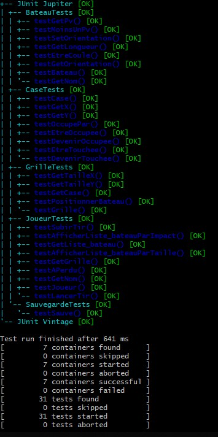

# Bataille navale

auteurs :
- SAKER Lucas
- CERISARA Théo

Ne pas tenir compte de l'identité des commiteurs, Théo a centralisé les commits et les push.

## Description

Bataille navale en mode mono-joueur (le joueur joue contre lui même), en mode texte (en ligne de commande) ou graphique (le joueur joue à la souris). 

## Comment compiler (et jouer)

Sous linux, lancer le script

    cd src
    bash compileAndRun.sh

Sous Windows, lancer le script

    cd src
    compileAndRun.bat

Une fois compilé, vous pouvez aussi lancer le jeu à la main en exécutant la classe Main:

    cd src
    java -cp . projet_bataille_navale.Main

qui vous donnera la possibilité de choisir l'un des 4 modes de jeu:

- Console : le joueur entre les commandes au clavier dans une console texte
- ConsoleAuto : le programme joue tout seul contre lui-même. Il n'y a aucune interaction avec le joueur. Ce mode sert à tester le jeu.
- Graphique : le joueur voit la grille dans un JPanel Swing et interagit avec le jeu via la souris.
- GraphiqueTest : mode graphique automatique

Enfin, un fichier projet.jar est egalement present: il vous suffit de double-cliquer dessus pour automatiquement
lancer le mode graphique.

Pour définir la taille de la grille en mode graphique, il faut entrer 2 entiers separes par un espace (par exemple : "10 12") dans le champ texte situé en haut de la fenetre.

Pour changer l'orientation du bateau en mode graphique, il faut cliquer avec le bouton droit de la souris.

# Explication des diagrammes UML
Le code source des diagrammes UML ainsi que les PNG se trouvent dans uml/

Vous pouvez recompiler les PNG avec la commande:

    cd uml
    java -jar plantuml.jar *.txt

## Diagramme de classe

Nous avons séparé la partie interface utilisateur du moteur du jeu. Pour cela nous avons créé une interface java GUI qui est implémentée par quatre classes : Console (pour le mode texte), ConsoleAuto (pour le mode texte automatique), Graphique (pour le mode graphique), et GraphiqueTest (pour le mode graphique automatique).

La classe GUI définit trois méthodes : 

- initJeu() pour initialiser la taille du bateau, le nom du joueur...
- positionnerBateau() pour permettre au joueur de poser ses bateaux
- jouer() pour tirer sur les bateaux

Le package "graphic" rassemble toutes les classes swing.

La classe abstraite bateau est implémentée par cinq classes : SousMarin, Torpilleur, Croiseur, ContreTorpilleur, PorteAvion

La classe Grille contient toutes les cases du plateau

La classe Joueur contient toutes les informations du moteur jeu : la grille, la liste des bateaux. C'est donc cette classe qu'il faut sauvegarder (sérialiser). Toutefois, pour le mode graphique il faut aussi sérialiser une deuxième grille qui n'affiche pas les bateaux mais les tirs déjà effectués. Ceci permet au joueur de ne pas voir ses bateaux lorsqu'il tire. 

La classe Jeu contient le main.

## Diagrammes de séquence

Nous avons choisi 3 scénario:

- Initialisation du jeu: un joueur pose un bateau
- Partie en cours : un joueur attaque un bateau qui ne coule pas
- Partie en cours : un joueur attaque un bateau et le coule

### Poser un bateau

- La classe Jeu crée les objets: Console, Bateaux, Grille et Joueur (les objets Case sont créés par la Grille).
- Ensuite la classe Jeu se contente de lancer la méthode "positionnerBateaux()" de la Console
- La Console s'occupe alors de demander aux joueurs les coordonnées initiales et l'orientation, mets à jour les bateaux avec ces informations
- Puis la Console récupère la case initiale, et exécute la méthode "positionnerBateau()" de la Grille
- La Grille vérifie alors que le bateau peut être posé à cet endroit, puis itère sur toutes les cases sur lesquelles le bateau doit être posé et appelle "devenirOccupee()" pour chacune.
- La Console affiche enfin la grille

### Attaquer un bateau sans le couler

- La Console récupère tous les objets impliqués dans l'attaque: grille, bateau et case
- La Console crée une deuxième grille pour "cacher" les bateaux et permettre au joueur de tirer sans voir les bateaux
- L'objet Joueur mets à jour les cases (si elles sont touchées), gère les points de vie des bateaux et vérifie si la partie est finie

### Attaquer un bateau en le coulant

Test presque identique au précédent, sauf pour la fin qui se résoud par la fin du jeu.

# Javadoc

La javadoc se trouve dans le répertoire javadocs/

Elle peut être regénérée avec la commande:

    cd javadocs
    javadoc -cp ../src projet_bataille_navale

# Tests unitaires

Nous utilisons la librairie JUnit-5 pour les tests unitaires.

Pour les lancer, exécuter soit le script compileAndRunTests.bat sous Windows, soit le script compileAndRunTests.sh sous Linux.

